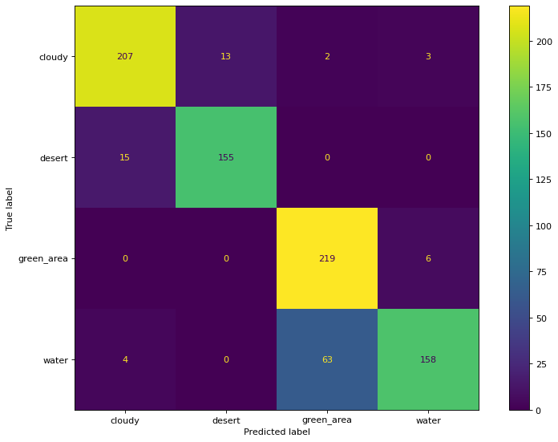
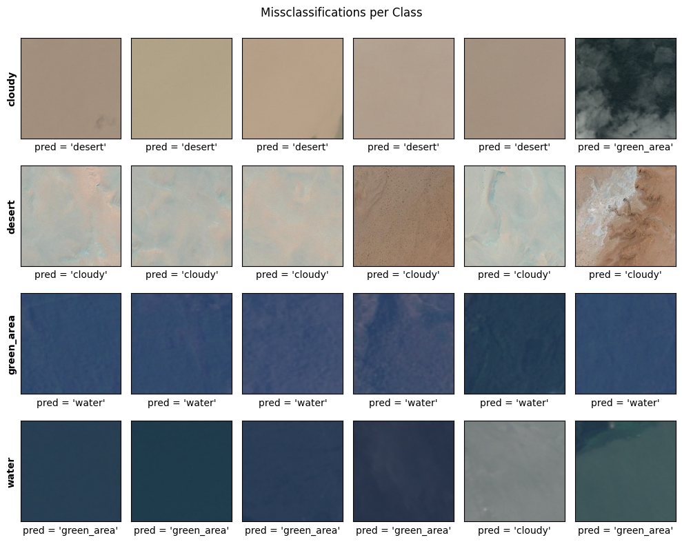

# Simple Satellite Image Classification

The objective  this project was to assess the difference between the `Adam`, `SGD` and `RMSProp` optimizers
in a task of image classification with neural networks trained using PyTorch.

- **Problem domain(s):** multi-class image classification.
- **Model architecture(s)**: Resnet.
- **Optimizer(s)**: Adam, Stochastic Gradient Descent and RMSProp.

## Dataset

Data used in this project corresponds to Remote Sensing (RS) images stored as `.jpg` files with relatively
small resolution. Each of the images is associated to exactly one of the following 4 classes:
- green area
- cloudy
- desert
- water

The figure below depicts examples for these images as well as their respective classes:

The data can be freely downloaded in the following [Kaggle dataset link](https://www.kaggle.com/datasets/mahmoudreda55/satellite-image-classification?resource=download).

## Performance

-----------------

